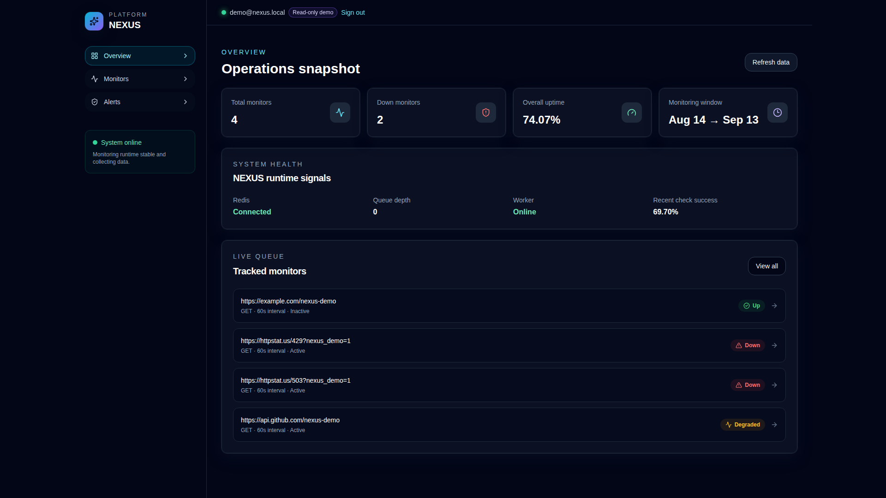
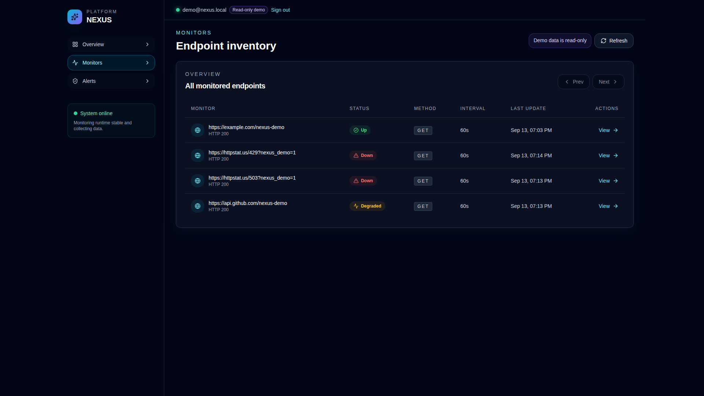
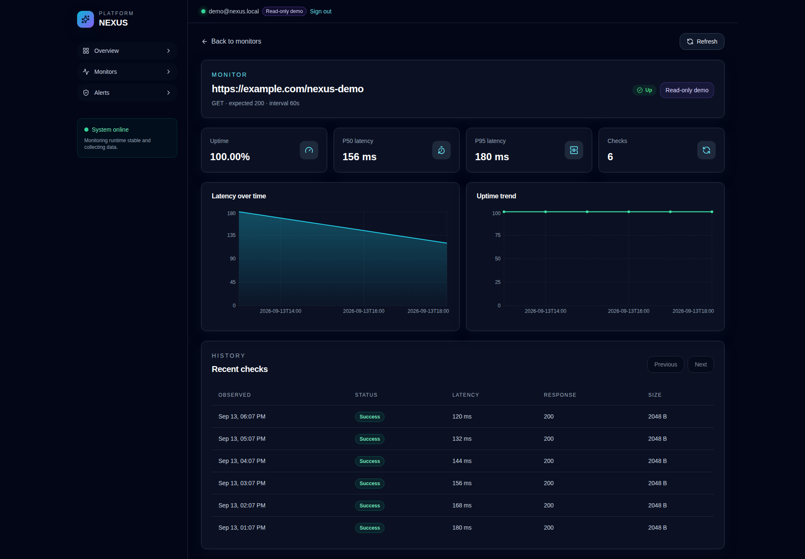
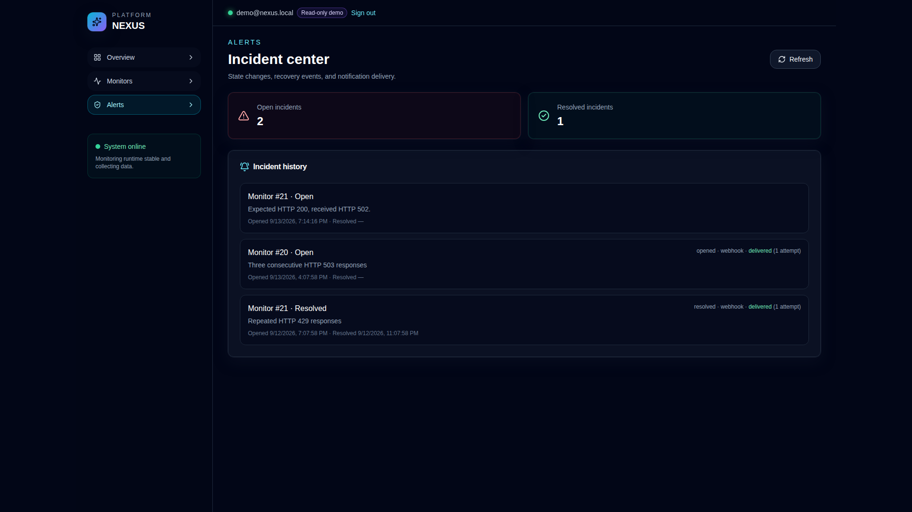

# NEXUS

**Production-oriented uptime/health monitoring platform** — distributed scheduling, Redis-backed queue, time-partitioned PostgreSQL storage, alerting with incident tracking, multi-user auth with rate limiting, public read-only demo mode, and structured observability.



---

## Screenshots

| Page | Description |
|------|-------------|
| **Overview** | System health panel, monitor summary, recent activity |
| **Monitors** | Paginated inventory with status badges, search, and filtering |
| **Monitor Detail** | Metadata, aggregate stats (uptime/latency percentiles), latency charts, paginated check history |
| **Alerts / Incidents** | Open and resolved incidents with trigger reasons, delivery status, and deduplication keys |





---

## Key Features

- **Distributed scheduling** — atomic, multi-instance-safe claiming of due monitors via PostgreSQL row locking
- **Redis-backed job queue** — transient monitoring jobs enqueued after claim; workers consume with bounded retries
- **Time-partitioned result storage** — PostgreSQL native partitioning by observation time; indexed by endpoint + timestamp for fast history and rollup queries
- **Incident detection & alerting** — consecutive-failure thresholds (`UP → DEGRADED → DOWN`), unique open-incident constraint, webhook deliveries with at-least-once retry and deduplication keys
- **Multi-user authentication** — bcrypt password hashing, short-lived JWTs in `httpOnly` cookies, ownership-scoped monitor/alert access
- **Rate limiting** — Redis fixed-window counters keyed by email + IP; separate limits for login (5/15min email, 20/hr IP) and signup (3/hr email, 10/15min IP); fails closed on Redis unavailability
- **Password reset** — cryptographically random single-use tokens (SHA-256 stored in Redis with 15-min TTL, atomic `GETDEL` consumption); generic responses to prevent enumeration
- **Public read-only demo mode** — seeded `demo@nexus.local` account with 4 monitors (up/down/degraded), open/resolved incidents, delivered alerts; mutation endpoints return 403; no periodic reset needed
- **Structured observability** — JSON log lines with UTC timestamp, level, event name, safe identifiers; `X-Request-ID` propagation; `/api/v1/health/metrics` exposes Redis health, queue depth, active monitors, worker heartbeat freshness, recent success rate

---

## Architecture Summary

```
┌─────────────┐     ┌─────────────┐     ┌─────────────┐     ┌──────────────────┐     ┌─────────────┐
│  Monitors   │────▶│  Scheduler  │────▶│    Redis    │────▶│   Workers        │────▶│  PostgreSQL   │
│  (config)   │     │  (claims)   │     │   (queue)   │     │  (checks)        │     │  (partitioned)│
└─────────────┘     └─────────────┘     └─────────────┘     └──────────────────┘     └─────────────┘
                                                                                           │
                                                                                           ▼
                                                ┌─────────────────────────────────────────────────────┐
                                                │                     API Layer                        │
                                                │  FastAPI: monitors, history, stats, incidents,      │
                                                │  alerts, auth, health/metrics                        │
                                                └─────────────────────────────────────────────────────┘
                                                                                           │
                                                                                           ▼
                                                ┌─────────────────────────────────────────────────────┐
                                                │                    Dashboard                         │
                                                │  Next.js: Overview, Monitors, Monitor Detail,       │
                                                │  Alerts/Incidents                                    │
                                                └─────────────────────────────────────────────────────┘
```

**Pipeline**: Monitors → Scheduler (DB row lock claim) → Redis Queue → Workers (HTTP checks) → PostgreSQL (partitioned time-series) → FastAPI (read + auth) → Next.js Dashboard

**Reliability boundaries**: DB claim and Redis enqueue are separate systems — not one atomic transaction. Schedule advances in DB before enqueue; a crash between them delays a check until the next interval (no exactly-once guarantee).

[Full architecture details →](docs/architecture.md) | [Monitoring decisions →](docs/monitoring/architecture-decisions.md) | [Read path →](docs/monitoring/read-path-architecture.md) | [Alerting →](docs/alerts-architecture.md) | [Auth →](docs/auth-architecture.md) | [Observability →](docs/observability.md)

---

## Tech Stack

| Layer | Technology |
|-------|------------|
| **API** | FastAPI 0.115, Uvicorn, Pydantic, SQLAlchemy 2.0, Alembic |
| **Database** | PostgreSQL 16 (native partitioning, async psycopg) |
| **Queue / Cache** | Redis 7 (job queue, rate limiting, token storage, worker heartbeats) |
| **Frontend** | Next.js 14 (App Router), React 18, TypeScript, Tailwind CSS, Recharts |
| **Auth** | bcrypt, PyJWT, `httpOnly`/`SameSite=Lax`/`Secure` cookies |
| **Reverse Proxy / TLS** | Caddy 2 (automatic HTTPS, `/api/*` → FastAPI, `/*` → Next.js) |
| **Orchestration** | Docker Compose (6 services: postgres, redis, backend, monitoring-worker, frontend, caddy) |
| **Linting / Formatting** | Ruff, Black, isort (Python); ESLint, TypeScript (frontend) |
| **Testing** | pytest + pytest-asyncio (backend); Jest + React Testing Library (frontend) |

---

## Try It / Demo

A public read-only demo account is seeded automatically on first migration:

```bash
# Start the stack (if not already running)
docker compose up --build -d

# Demo login (no credentials needed)
curl -X POST http://localhost:8001/api/v1/auth/demo-login
```

Then open **http://localhost:3001** — you're logged in as `demo@nexus.local` with:
- 4 pre-configured monitors (up, down, degraded, inactive)
- Real check history and latency data
- 1 open incident, 1 resolved incident
- Delivered webhook alert records
- All mutation endpoints (create/update/delete monitors, trigger checks) return `403 Demo accounts are read-only.`

The frontend hides mutation controls for demo sessions; the API dependency is the security boundary. No periodic reset job is needed — read-only enforcement keeps the dataset stable.

[Demo mode details →](docs/demo-mode.md)

---

## Running Locally

### Prerequisites
- Docker and Docker Compose
- Git

### Start the stack

```bash
# 1. Clone
git clone https://github.com/your-org/nexus.git
cd nexus

# 2. Configure environment
cp .env.example .env
# Edit .env if needed (defaults work for local development)

# 3. Build and start all services
docker compose up --build -d

# 4. Access the application
# Frontend (dashboard):     http://localhost:3001
# Backend API:              http://localhost:8001
# API docs (Swagger):       http://localhost:8001/docs
# Health metrics:           http://localhost:8001/api/v1/health/metrics
# PostgreSQL (host port):   localhost:5433
# Redis (host port):        localhost:6380
# Caddy HTTP proxy:         http://localhost:8080
# Caddy HTTPS (self-signed): https://localhost:8443
```

The backend container runs Alembic migrations automatically before starting the API.

### Required `.env` variables (from `.env.example`)

| Variable | Purpose | Dev Default |
|----------|---------|-------------|
| `JWT_SECRET_KEY` | JWT signing secret | `replace-with-a-long-random-secret` |
| `ADMIN_EMAIL` / `ADMIN_PASSWORD` | Bootstrap admin account | `admin@nexus.local` / `change-me-immediately` |
| `FRONTEND_ORIGIN` | CORS origin for credentials | `http://localhost:3001` |
| `APP_ENV` | `development` or `production` | `development` |
| `NEXUS_DOMAIN` / `CADDY_EMAIL` | Production TLS config | (unset for local) |

**For production deployment**: Set `APP_ENV=production`, `NEXUS_DOMAIN=yourdomain.com`, `CADDY_EMAIL=you@yourdomain.com`, `FRONTEND_ORIGIN=https://yourdomain.com`, point DNS A/AAAA records at the host, expose ports 80/443, and run `docker compose up --build -d`. Caddy will obtain and renew a public certificate automatically.

[Auth transport security →](docs/auth-transport-security.md) | [Rate limiting →](docs/rate-limiting.md) | [Password reset →](docs/password-reset.md)

### Run backend tests

```bash
source .venv/bin/activate
cd backend
pytest
```

---

## Known Limitations / Honest Scope

This is a portfolio project demonstrating production-oriented patterns — not a finished SaaS. The following are **intentional scope boundaries**, not bugs:

| Area | Limitation | Why It's Here |
|------|------------|---------------|
| **Exactly-once delivery** | Schedule advances in DB before Redis enqueue; crash between them delays a check | Avoids distributed transaction complexity; acceptable for monitoring intervals |
| **Session refresh** | No refresh tokens; expired JWT requires re-login | Simplifies auth model; 60-min default expiry is reasonable for dashboards |
| **Email delivery** | Password reset links logged in dev only; no email provider configured | Production should integrate Resend/SendGrid/SES at the logged link extension point |
| **OAuth / SSO** | Not implemented | Requires backend contract changes; deferred to future milestone |
| **Alert acknowledgment** | No operator workflow for acknowledging/resolving incidents in UI | Backend contract exists; frontend work pending |
| **Query caching** | Frontend fetches fresh on every navigation | React Query / SWR can be added after backend contracts stabilize |
| **Horizontal scheduler scaling** | Single scheduler instance assumed for claim safety | Multi-instance claiming works via DB row locks; not stress-tested at scale |
| **Prometheus metrics** | `/health/metrics` is JSON only; no `/metrics` Prometheus endpoint | Can be added without changing dashboard contract |

These trade-offs are documented in [architecture.md](docs/architecture.md#reliability-boundaries), [known-issues.md](docs/known-issues.md), and each feature doc. They reflect engineering maturity — knowing what you *didn't* build and why — not incompleteness.

---

## License

MIT License — see [LICENSE](LICENSE) for details.

Copyright (c) 2026 NEXUS contributors